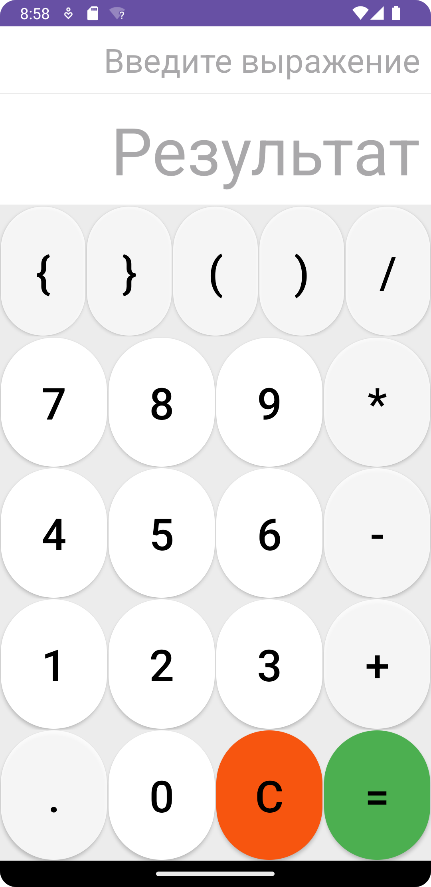

# Oshibki_novich
<h1 align="center">Калькулятор/Calculator</a> </h1>
<h3 align="center">Далее будут описаны способы запуска проекта, а также документация по его использованию.</h3>
<h2 align="center">Запуск приложения/Launching the app</a></h2>

Внимание! Для запуска и сборки приложения используется Android studio. Также следует проверить установил ли Gradle все зависимости.

Запустить приложение можно двумя способами:

<ul>
<li> Из IDE на виртуальной машине или реальном смартфоне версии 7.0 и выше  </li>
<li> Собрать APK файл и запустить его на смартфоне версии 7.0 и выше </li>
</ul>
<h3>Запуск приложения из IDE</h3>

Для начала, откройте папку AndroidCalculator как проект в android studio. Для запуска приложения на виртуальной машине следует нажать 'Run 'app'' (зеленый треугольник в верхней панели инструментов).
При этом вам возможно придется решить проблему с HAXM.

Для запуска приложения на реальном android устройстве, следует подключить его проводом к компьютеру. Далее выберите свое устройство в выпадающем списке на панели инструментов. Нажмите 'Run 'app'' (зеленый треугольник).

<h3>Запуск приложения из APK файла</h3>

Для начала создадим APK файл. Запускаем Android studio и открываем папку AndroidCalculator как проект. Сверху, выберите «Build → Build Bundle(s)/APK(s) →Build APK(s)». Далее в Oshibki_novichka\AndroidCalculator\app\build\outputs\apk\debug\ появится APK файл со всеми необходимыми зависимостями. Перемещаем его на смартфон и запускаем.

<h2 align="center">Документация/Documentation</h2>

На изображении представлен главный экран калькулятора. Как можно заметить он состоит из множества кнопок и двух полей вывода.

Далее представлен краткий список кнопок и их назначение(знак ',' далее является разделителем):

<ul>
<li> 1,2,3,4,5,6,7,8,9,0 - предназначены для ввода числа</li>
<li> +,-,*,/ - операции с числами, соотвественно сложение, вычитание, умножение, деление</li>
<li>{,} - знаки для ввода вектора(пока не реализовано) </li>
<li>(,) - скобки используются как скобки в математическиз выражениях</li>
<li>. - используется для введения дробных чисел</li>
<li> = - используется для вычисления выражания и вывода результата</li>
<li> С - очистка поля ввода</li>
</ul>

